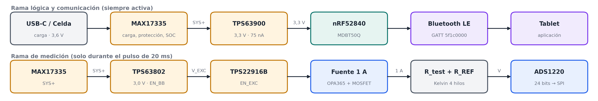
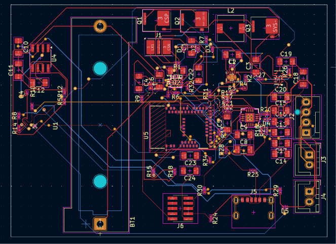
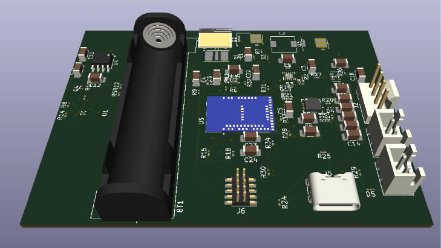
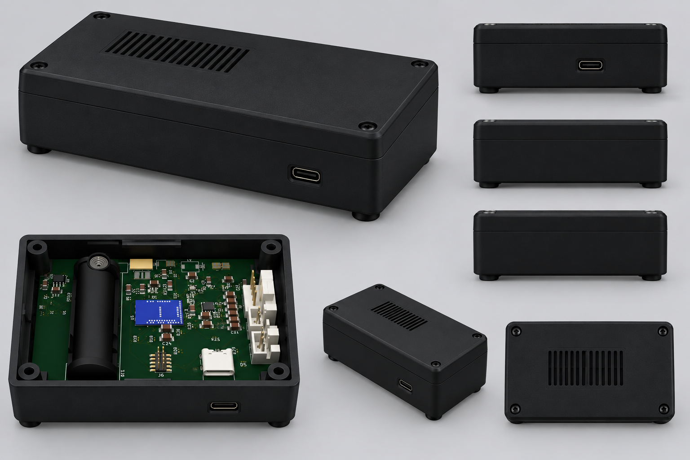

# Medidor de resistencia de baja magnitud IoT

Diseño y simulación de un instrumento portátil que mide resistencias de hasta **1 Ω** (rango útil 1 mΩ–1,2 Ω) con resolución de **10 µΩ**, alimentado por una celda Li-ion 18650 y conectado por **Bluetooth Low Energy** a una aplicación Android, que muestra la resistencia, el porcentaje de batería y el tiempo de carga.

Autor: Jarol Nicolás Molano López — Ingeniería Electrónica (E3T), Universidad Industrial de Santander.

**Video de la demostración:** https://youtu.be/Hf0qGaK_6uc

## Principio de medición
Medición **ratiométrica con conexión Kelvin de 4 hilos**. Un pulso de 1 A durante 20 ms recorre en serie la resistencia bajo prueba y una referencia de 1,2 Ω (±0,05 %). El ADS1220 de 24 bits mide la relación entre ambas tensiones, de modo que la exactitud de la corriente se cancela:

$$R_{test}=\frac{\text{Código}\cdot R_{REF}}{2^{23}\,G}$$

## Resultados principales
| Parámetro | Valor |
|---|---|
| Rango útil | 1 mΩ – 1,2 Ω |
| Resolución / precisión | 10 µΩ (≈18 bits efectivos del ADS1220) |
| Exactitud en 1 Ω | ±0,058 % típica, ±0,19 % peor caso |
| Consumo en reposo | 36,9 µA |
| Autonomía (1 medición/min) | ≈ 351 días |
| PCB | 4 capas, 78 × 57,3 mm |
| Costo estimado | ≈ 60 USD ensamblada |

## Organización del repositorio
| Rama | Etapa | Contenido |
|---|---|---|
| [`etapa-gestion-bateria`](https://github.com/JarolNM/Diseno-Circuitos-Medidor-Resistencia-IoT/tree/etapa-gestion-bateria) | I–II | Celda Molicel M35A y MAX17335 (carga, protección, SOC) |
| [`etapa-potencia-dcdc`](https://github.com/JarolNM/Diseno-Circuitos-Medidor-Resistencia-IoT/tree/etapa-potencia-dcdc) | III | TPS63900 (riel lógico 3,3 V) y TPS63802 (riel de excitación 3,0 V) |
| [`etapa-medicion`](https://github.com/JarolNM/Diseno-Circuitos-Medidor-Resistencia-IoT/tree/etapa-medicion) | IV | Fuente de 1 A (OPA365 + CSD13380F3 + TPS22916B) y ADS1220 |
| [`etapa-microcontrolador`](https://github.com/JarolNM/Diseno-Circuitos-Medidor-Resistencia-IoT/tree/etapa-microcontrolador) | V | nRF52840 (MDBT50Q), BLE, consumo y validación |
| `main` | — | Este resumen, el firmware, el esquemático completo y las figuras generales |

Cada rama de etapa tiene la misma estructura:
- `01_..._Solucion_Seleccionada/Datasheets_y_Notas_de_Aplicacion`: documentos del fabricante usados.
- `01_..._Solucion_Seleccionada/Sustentacion_Calculos`: ecuaciones (`README.md`) y un script de Python que reproduce cada número del informe.
- `01_..._Solucion_Seleccionada/Esquematicos_y_Simulaciones`: recortes del esquemático y simulaciones.
- `02_...`, `03_...`, `04_...`: alternativas evaluadas y por qué se descartaron, con enlaces a sus datasheets.

## En esta rama
| Archivo | Descripción |
|---|---|
| [`firmware/medidor_nrf52840`](firmware/medidor_nrf52840) | Firmware del nRF52840 (Arduino + Bluefruit) |
| [`esquematico_completo.pdf`](esquematico_completo.pdf) | Esquemático completo (KiCad) |
| [`figuras/`](figuras) | Diagrama de bloques, esquemático, *layout*, vista 3D y carcasa |

| | |
|---|---|
|  |  |

